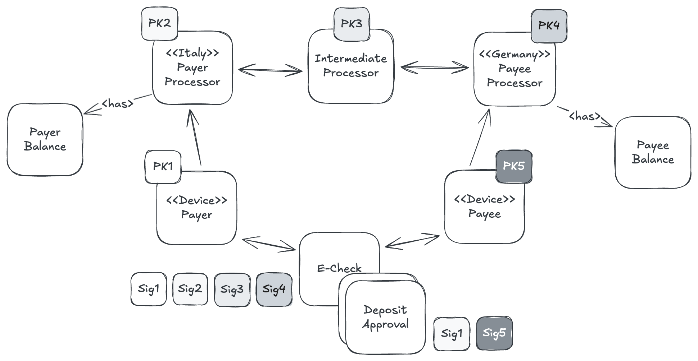
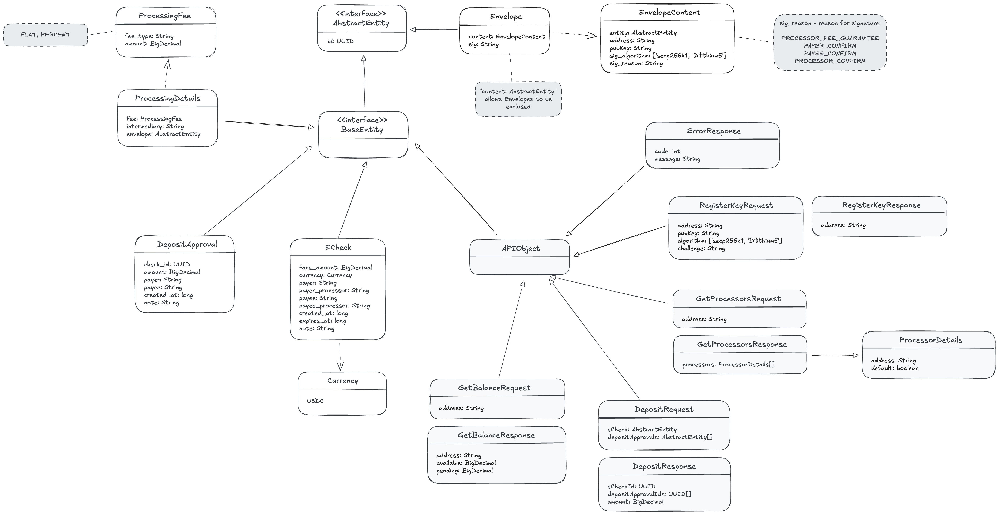

# Libralink Protocol v1

## Context

<p align="center">
    
</p>

## API Endpoints

- `POST /processor/trusted` - get trusted processors list to determine if Payer/Payee payment is possible
- `POST /account/register` - register `Public Key` at Processor
- `POST /account/balance`

- `POST /echeck/pre-issue` - validates E-Check envelope and calculates processor fee, 
no Processor signature at this point
- `POST /echeck/issue` - blocks Payer funds, provides fees & Processor(s) signature(s)
- `POST /echeck/deposit` - blocks Payer funds, provides fees & Processor(s) signature(s)

## API Object Model

<p align="center">
    
</p>

## Use Cases
`[Real Life Scenario] Payee is selling $2 coffee and needs to receive payment from Payer`

### [UC 1. Processors Exchange]
TBD

### [UC 2. E-Check Issue] Payer is Online
In such a case Payer needs to issue the E-Check precisely with $2 face amount 
to cover the Payee request.

As Payer is online and has access to his Processor, the steps will be the following:

1. Payer creates $2 E-Check with all the details (payer, payee, processor, etc)
2. Payer signs the E-Check (with `IDENTITY` signature) and sends it to `/echeck/pre-issue` for Processor to calculate fee
3. Processor calculates & adds the fee, and signs E-Check with `FEE_LOCK` (such signature guarantees the fee amount)
4. Payer accepts the fee by confirming the E-Check with `CONFIRM` signature, resulting E-Check is sent to `/echeck/issue`
5. Processor blocks the Payer funds, provides `CONFIRM` signature and returns E-Check to Payer

At this stage the E-Check is issued and can be provided to Payee.

### [UC 3. E-Check Issue] Payer is Offline
When Payer is offline, Payee has the chance to help Payer to do the E-Check issue, the steps will be the following:

1. Payee creates $2 E-Check with all the details (payer, payee, processor, etc)
2. Payee signs the E-Check (with `IDENTITY` signature) and sends it to `/echeck/pre-issue` for Processor to calculate fee
3. Processor calculates & adds the fee, and signs E-Check with `FEE_LOCK` (such signature guarantees the fee amount)
4. Payee shares resulting E-Check with Payer
5. Payer accepts the fee by confirming the E-Check with `CONFIRM` signature
6. Payee sends resulting E-Check to `/echeck/issue`
7. Processor blocks the Payer funds, provides `CONFIRM` signature and returns E-Check to Payee
8. Payee can share the E-Check with Payer (optional)

### [UC 4. Deposit Approval] Initiated by Payee
Payee as soon as it received fully issued E-Check, can't do anything with it. Payee needs to have `Deposit Approval` 
signed by both parties (Payer & Payee). Such `Deposit Approval` allows Payee to deposit E-Check to the amount, mentioned on `Deposit Approval`.

In case of Payee initiated Deposit Approval, the steps will be the following:

1. Payee creates and signs (with `CONFIRM` signature) Deposit Approval for an amount of $2
2. Payee shares signed Deposit Approval with Payer
3. Payer signs (with `CONFIRM` signature) Deposit Approval. Signature signifies that Payer agrees to pay the mentioned amount 
4. Payer shares signed Deposit Approval with Payee

It's important to notice that all steps are done offline, no communication to Processor is needed.

### [UC 5. Deposit Approval] Initiated by Payer
In a scenario, when Payer needs to do the payment (e.g. to cover monthly service subscription) and 
Payee isn't necessarily available to create the Deposit Approval, the Payer can create the Deposit Approval alongside the E-Check. The steps will be the following: 

`Pre-condition: E-Check is issued`
1. Payer creates and signs (with `CONFIRM` signature) Deposit Approval for an amount of $2
2. Payer sends both E-Check & Deposit Approval to Payee

As a result, the Payee can add its own signature to Deposit Approval at any time later to accomplish the payment.

### [UC 6. Deposit] Payee calls Processor to deposit E-Check 

As soon as Payee has E-Check (not expired) and related Deposit Approval (or multiple), they can be sent to Processor for check deposit. The steps will be the following:

1. Payee constructs `DepositRequest` with embedded E-Check and Deposit Approval(s) and signs it (with `IDENTITY` signature) 
2. DepositRequest is sent to `/echeck/deposit`
3. Processor validates the request (Deposit Approval relation to E-Check, E-Check expiration, SUM(Deposit Approval) <= E-Check, etc)
4. Processor moves Payer funds to Payee account
5. Processor marks E-Check and processed to prevent double processing

The signature by Payee is important, because deposit request can be done just once.

### [UC 7. Corner Case] Both parties are Offline
If there is a scenario that both parties can be offline, Payer has the possibility to issue the E-Check in advance in name of Payee to use it later.

E.g. Payer can issue the E-Check for $100 when he is online and then use the E-Check offline to pay to Payee until the $100 is reached.
The can will be the following:

`Pre-condition 1: Payer knows Payee trusted processors, i.e. Payer already has the financial relationships with Payee`

`Pre-condition 2: Payer issues $100 E-Check in the name of Payee`

1. [When Offline] Payer provides the E-Check to Payee
2. [When Offline] Payer signs (with `CONFIRM` signature) one or multiple Deposit Approvals
3. [When Offline] Payee signs (with `CONFIRM` signature) one or multiple Deposit Approvals
4. [When Online] Payee constructs & sends DepositRequest to Processor (Use Case 6)

## [Appendix] E-Check change through the Issue Steps
1. Payer creates E-Check and signs it to be pre-processed by Processor, the signed payload looks like
```
{
  "objectType": "Envelope",
  "id": "19360ffc-dd19-4294-99ed-d0858082b48d",
  "content": {
    "entity": {
      "objectType": "ECheck",
      "id": "bfcb823c-4506-4e17-b715-59de993d15fe",
      "faceAmount": 150,
      "currency": "USDC",
      "payer": "0xf39902b133fbdcf926c1f48665c98d1b028d905a",
      "payerProcessor": "0x127cc4d943dff0a4bd6b024a96554a84e6247440",
      "payee": "0x8f33dceeedfcf7185aa480ee16db9b9bb745756e",
      "payeeProcessor": "0x127cc4d943dff0a4bd6b024a96554a84e6247440",
      "createdAt": 1743526954033,
      "expiresAt": 2743526954133,
      "note": "Online courses payment, order #123"
    },
    "pub": "0xf39902b133fbdcf926c1f48665c98d1b028d905a",
    "sigReason": "IDENTITY"
  },
  "sig": "0xded9970d473b31ec96cf7c9276c2269ebd80dfb889f6a15ccd46a240bd1f20855e8f7f4eeeda6945db75b335e84ee2ae95ed5ba2252c380043f6c61ace878ef11b"
}
```
The payload is sent to `/echeck/pre-issue` endpoint

2. Processor calculates the fee and enriches the E-Check payload, resulting Envelope is signed with Processor PK

```
{
  "objectType": "Envelope",
  "id": "a3bea111-713d-4972-8a50-8a33a8ea9cf5",
  "content": {
    "entity": {
      "objectType": "ProcessingDetails",
      "id": "9f3b5bde-b5fb-43b5-90b2-e32238d460be",
      "fee": {
        "feeType": "percent",
        "amount": 1.5
      },
      "intermediary": null,
      "envelope": {
        "objectType": "Envelope",
        "id": "19360ffc-dd19-4294-99ed-d0858082b48d",
         ...
      }
    },
    "pub": "0x127cc4d943dff0a4bd6b024a96554a84e6247440",
    "sigReason": "FEE_LOCK"
  },
  "sig": "0xcb4321d03b818242cd67c54844bde140b1f1ea0c96f68fcd6a8d31e3407c8eb86f5a22b49a4d085bc4e77429fc7ca479fa593b01c3e888c753b13fc8dea9ca721c"
}
```
This Processor signature and `sigReason = FEE_LOCK` guarantees the fee at a time of E-Check issue and depositing later.

3. Payer verifies the fee, and agrees with fee by confirming the E-Check, resulting signature looks like.

```
{
  "objectType": "Envelope",
  "id": "fe19bd71-b2fa-4ad2-9c3c-d5e01a1908f2",
  "content": {
    "entity": {
      "objectType": "Envelope",
      "id": "a3bea111-713d-4972-8a50-8a33a8ea9cf5",
      ...
      "sig": "0xcb4321d03b818242cd67c54844bde140b1f1ea0c96f68fcd6a8d31e3407c8eb86f5a22b49a4d085bc4e77429fc7ca479fa593b01c3e888c753b13fc8dea9ca721c"
    },
    "pub": "0xf39902b133fbdcf926c1f48665c98d1b028d905a",
    "sigReason": "CONFIRM"
  },
  "sig": "0x5f03ac8d7f3d05c94ec4617e46c148340c048d75017986d2abd7a2bc4d335c834442bdb6895e1c9f40c2755ece27c98d517a3fd8a67f67d56c6546ee06a4f71d1b"
}
```
Resulting E-Check is sent to `/echeck/issue` to be issued.

4. Processor verifies the E-Check and blocks the Payer balance amount needed to guarantee the E-Check payment, if successful, then Processor signs the E-Check and returns it to Payer

```
{
  "objectType": "Envelope",
  "id": "44d00856-57ff-482d-b7fc-2762e88dccdb",
  "content": {
    "entity": {
      "objectType": "Envelope",
      "id": "fe19bd71-b2fa-4ad2-9c3c-d5e01a1908f2",
      ...
    },
    "pub": "0x127cc4d943dff0a4bd6b024a96554a84e6247440",
    "sigReason": "CONFIRM"
  },
  "sig": "0x1c9c03a3a41417e8afa06482c8a8c49bf3b3774edf667ea2fa600173a981c3bd5b42a966526dc720b95138d7480f33d877f9682455d2eabe63f067d02c9b811d1b"
}
```

The confirmation by Payer and Processor(s) signify that E-Check is issued and can be used in financial relationship with Payee
