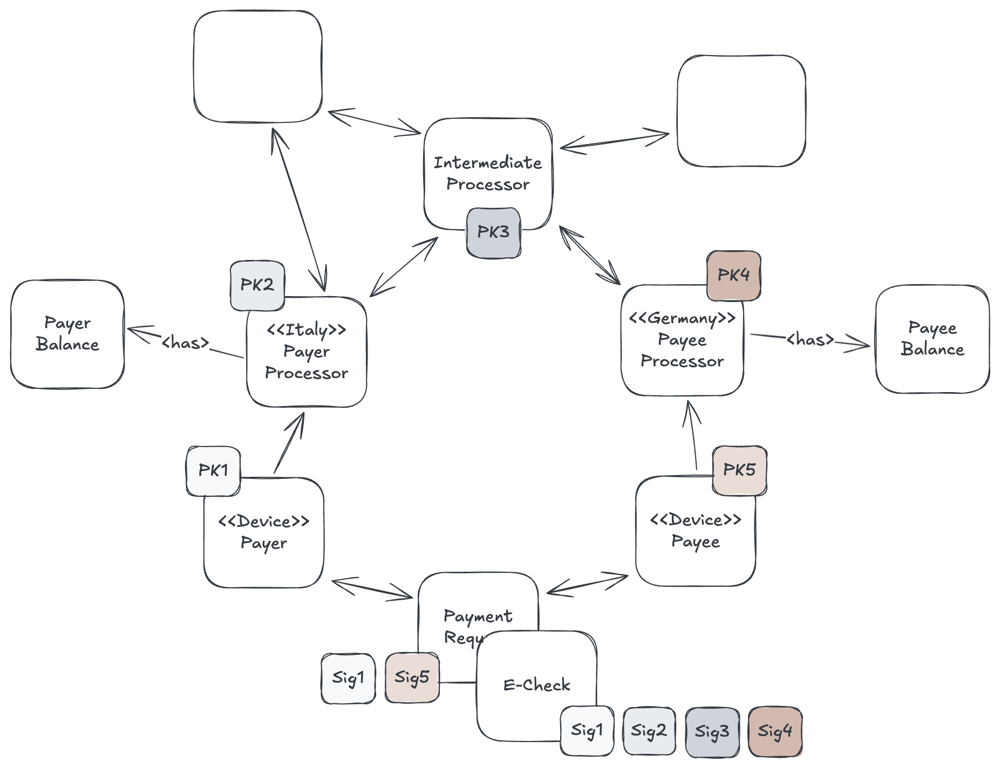
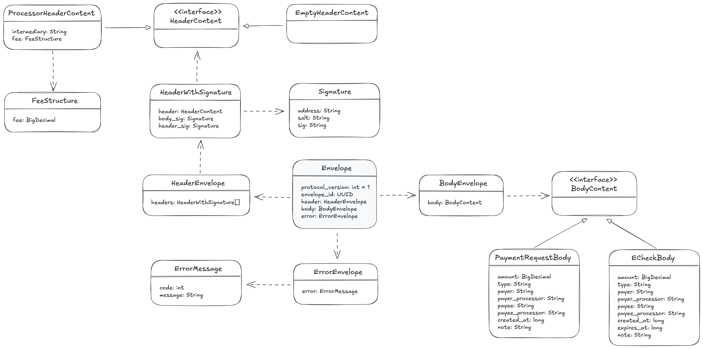
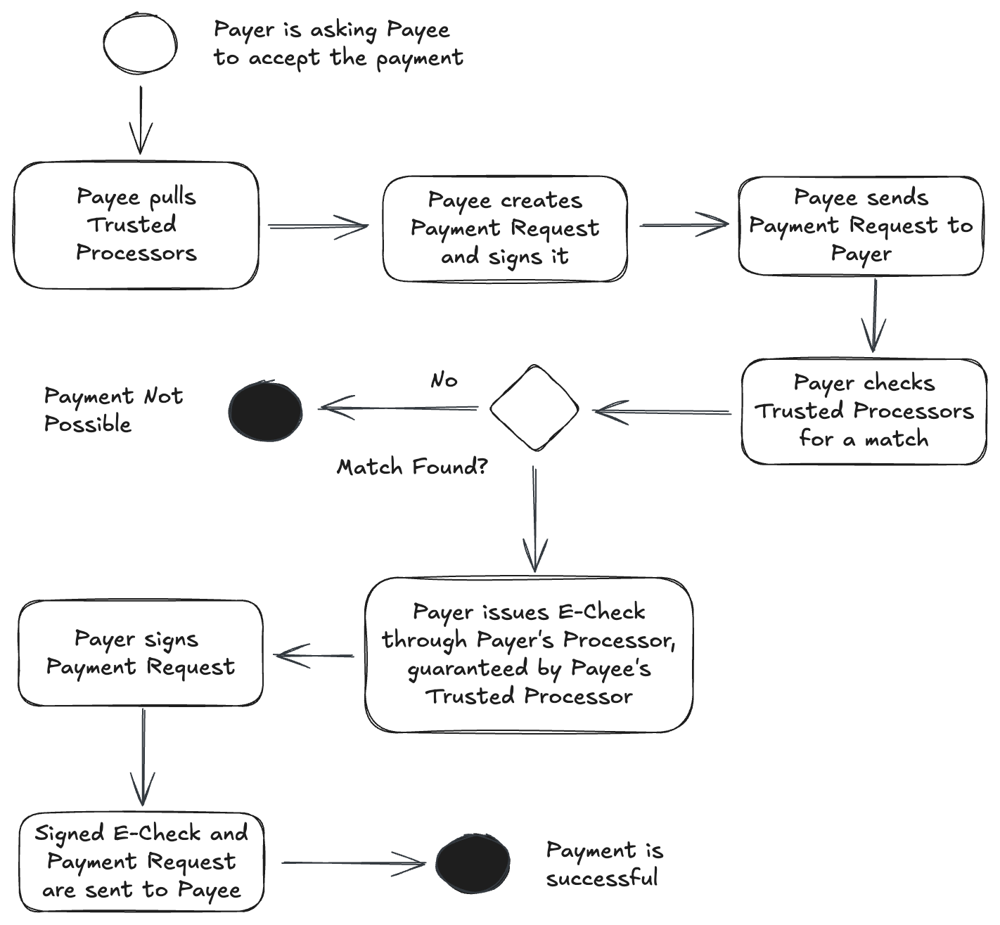
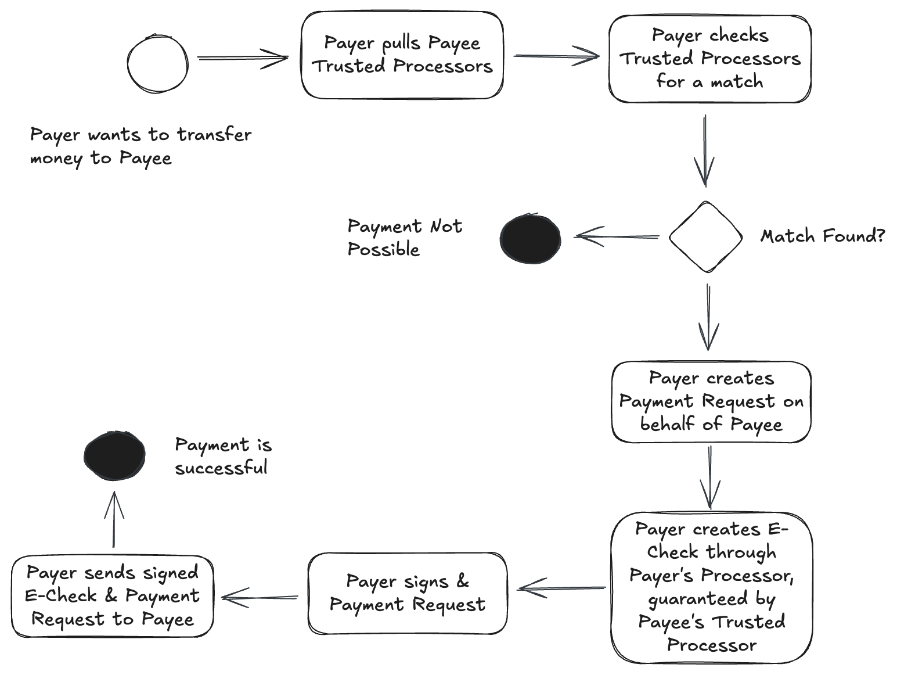
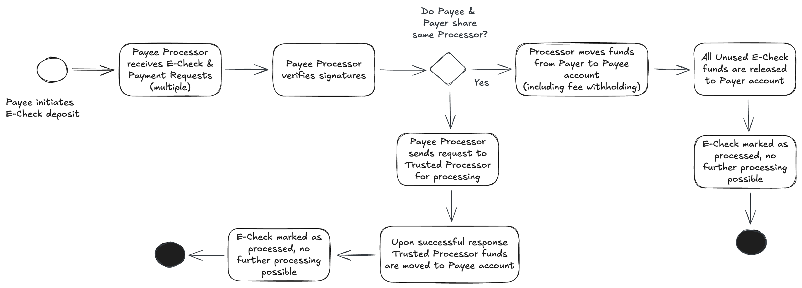

# Libralink Protocol v1

## Context

    

## API Endpoints
- `GET /processors/trusted` - Lorem ipsum dolor sit amet, consectetur adipiscing elit, sed do eiusmod tempor incididunt ut labore et dolore magna aliqua
- `POST /payer/echeck-pre-issue`
- `POST /payer/echeck-issue`
- `POST /payee/request`
- `POST /payee/echeck-deposit`

## API Object Model

    

## Details
### Processing Fee
TBD

##### Total Amount
TBD

### Error Message
TBD 

#### Errors
- `100` - Insufficient funds
- `200` - Invalid Payer signature
- `201` - Invalid Payee signature
- `9xx` - Extension, user defined error codes

## Use Cases

### Payee initiated Payment

    

TBD

### Payer initiated Payment

    

TBD

### Payee deposits E-Check

    

### Partial Internet Access
TBD

### Offline Payment (neither Payee, not Payer have Internet Access)

    

